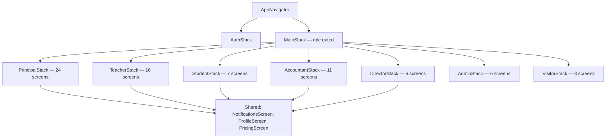

# School App — Full UI/UX & Architecture Audit Report

**Scope analyzed:** 87 screens · 34 shared components · 9 navigation stacks · 1 token file
**Method:** Static analysis of every `.tsx` file in `src/` — header usage, color/spacing/typography values, component imports, navigation wiring, file size as a complexity proxy.

---

## 1. Executive Summary

The app is not actually broken — it's **un-unified**. A solid design token system (`theme/tokens.ts`) and several genuinely good shared components (`StandardPageHeader`, `RoleTabBar`, `motion.ts`, `SkeletonLoader`) already exist. The problem is **adoption**: most screens were built independently and bypass the shared system entirely, each reinventing headers, tab bars, spacing, and colors slightly differently.

Headline numbers from the codebase:

| Metric | Finding |
|---|---|
| Screens using the shared `StandardPageHeader` | **10 of 87** (11%) |
| Distinct tab bar implementations | **6** separate files, none reusing the generic `RoleTabBar` |
| Distinct `borderBottomLeftRadius` values on headers | **11** different values (28, 30, 32, 34, 35, 40, 20, 18, 12, 0, and a token reference) |
| Distinct `paddingBottom` values on headers | **10** different values |
| Unique hardcoded hex colors across screens | **231** |
| Distinct `fontSize` values in use | **23** (a healthy scale has 6–8) |
| Distinct raw spacing values (padding/margin) | **40** |
| Screens using `Theme.spacing` tokens | **0** |
| Screens using `SkeletonLoader` | **0** (57 screens use a bare spinner instead) |
| Screens with any empty-state handling | **29 of 83** (35%) |
| Largest single screen file | `DirectorDashboardScreen.tsx` — **3,142 lines** |
| Competing input components | `AppInput.tsx` vs `CustomInput.tsx` |

This is why the app "looks different on every screen" — it genuinely is different on every screen, at the code level, not just visually. The fix is not a redesign; it's **enforcing the system that already exists** and deleting the parallel ones that compete with it.

---

## 2. Project Structure Analysis

### 2.1 Folder structure
```
src/
├── api/                  → 2 files (legacy auth + client, partially overlaps services/)
├── assets/               → logo.png, logo2.png
├── components/
│   ├── common/           → 14 shared UI primitives (Header, AppButton, AppCard, AppInput, etc.)
│   ├── layout/           → 6 independent tab bars + 1 unused generic RoleTabBar + 2 header variants
│   ├── principal/        → 1 role-specific component
│   └── teacher/          → 1 role-specific component
├── config/               → api.config.ts
├── constants/            → roles.ts, headerConstants.ts
├── context/              → AuthContext, NotificationContext
├── hooks/                → useApi, useNetworkState, useUnreadNotifications
├── navigation/           → 9 stack files + AppNavigator + types
├── screens/              → 87 screens across 10 role folders
├── services/             → 13 service files (role-specific + shared api.ts)
├── storage/              → storage.ts, StorageKeys.ts
├── theme/                → tokens.ts (complete), motion.ts (complete, unused)
└── utils/                → 11 utility files including a duplicate shadowStyles.ts
```

### 2.2 Screen count by role
| Role folder | Screen count |
|---|---|
| principal | 24 |
| teacher | 16 |
| accountant | 11 |
| student | 7 |
| admin | 6 |
| director | 6 |
| auth | 6 |
| common | 5 |
| public | 3 |
| visitor | 3 |
| **Total** | **87** |

### 2.3 Navigation architecture
9 separate stack navigators (`PrincipalStack`, `TeacherStack`, `StudentStack`, `AccountantStack`, `DirectorStack`, `AdminStack`, `VisitorStack`, `AuthStack`, `MainStack`) composed inside one `AppNavigator.tsx`, which also directly imports ~60 screen components and 6 tab bar components. This is a reasonable shape for a multi-role app but the navigator file itself has become a god-file with all role wiring centralized in one place — fine for now, but it's the first place that will become unmanageable as more screens are added.

### 2.4 Component dependency map (key finding)
```
theme/tokens.ts (Theme.colors, .spacing, .radius, .shadow, .typography)
  ├─ used partially by ~75 files for colors
  ├─ .spacing → used by 0 screens
  └─ .typography → used by 75 files (but 23 raw fontSize values still float around)

theme/motion.ts (durations, easings, springs)
  └─ used by 0 screens — every screen hardcodes its own Animated timing values

components/layout/RoleTabBar.tsx (generic, well-built, accepts tabs+accentColor props)
  └─ used by 0 of 6 actual tab bars in production

components/layout/{CustomTabBar, AccountantTabBar, TeacherTabBar,
                    AdminTabBar, DirectorTabBar, PrincipalTabBar}.tsx
  └─ 6 independent implementations, 238–378 lines each, ~1,600 lines of
     duplicated tab bar logic that RoleTabBar already generalizes

components/layout/StandardPageHeader.tsx  → used by 10 screens
components/layout/AccountantPageHeader.tsx → competing header, different padding/radius
components/common/Header.tsx              → third competing header, white bg not navy
[77 screens]                              → hand-rolled inline LinearGradient headers
```

This is the single most important structural finding in the audit: **the reusable components exist, but the screens don't call them.**

---

## 3. Screen Audit

A full 87-row table is impractical to hand-place here, so this section gives the representative pattern per role plus every screen flagged with a specific issue. (Ask for the full per-screen table as a spreadsheet if you want every row — it's a direct grep job from here.)

| Screen | Route | Purpose | Issues found |
|---|---|---|---|
| PrincipalDashboardScreen | `PrincipalDashboard` | Principal home/stats | Inline `LinearGradient` header, `borderBottomLeftRadius: 28` (not 30) |
| TeacherDashboardScreen | `TeacherDashboard` | Teacher home/stats | Inline header, uses `HEADER_CONSTANTS.BORDER_RADIUS` correctly but still not via shared component |
| StudentDashboardScreen | `StudentDashboard` | Student home | `borderBottomLeftRadius: 32` |
| AccountantDashboardScreen | `AccountantDashboard` | Accountant home | `borderBottomLeftRadius: 34`, custom gradient header |
| DirectorDashboardScreen | `DirectorDashboard` | Director home/billing overview | **3,142 lines** — largest file in the app, needs splitting into sub-components before any redesign work |
| screens/accountant/FeeManagementScreen.tsx | `AccountantFeeManagement` | Re-exports principal's screen | Not a bug, but a smell — accountant has zero role-specific fee UI; confirm this is intentional |
| screens/accountant/{ExpenseScreen, PaymentEntryScreen, ReportsScreen, SettingsScreen} | various | Accountant tools | All exactly **93 lines** — placeholder-quality screens ("Reporting dashboards are being generated.") not yet built out |
| NotificationsScreen | `Notifications` | Shared notifications list | Source of the 422 error audited separately; also lacks `StandardPageHeader` |
| LoadingScreen | n/a (splash) | App boot screen | Purple blob accent colors, off-brand vs. navy primary |
| LoginScreen | `Login` | Auth entry | No navy header — white background throughout, brand moment missing on first screen |
| 3× public registration screens | `screens/public/*` | First-touch onboarding for new teachers/students/principals | No shared header; `StudentRegisterPublicScreen.tsx` is **2,011 lines** — needs decomposition |
| AttendanceScreen (×4 variants: principal, teacher, teacher/MarkAttendance, teacher/ViewAttendance) | various | Attendance flows | 4 separate large files (2,701 / 2,623 / unspecified / 1,587 lines) implementing overlapping UI patterns independently |

### Screens needing structural attention first (>1,500 lines)
```
DirectorDashboardScreen        3,142 lines
StudentManagementScreen        3,022 lines
AttendanceScreen (principal)   2,701 lines
AttendanceScreen (teacher)     2,623 lines
TeacherManagementScreen        2,371 lines
StudentRegistrationScreen      2,367 lines
BranchDetailsScreen            2,334 lines
AdminDashboardScreen           2,309 lines
StudentRegisterPublicScreen    2,011 lines
MarksEntryScreen               2,009 lines
```
These files are too large to safely restyle in place — any header/spacing change risks merge conflicts and regressions. They should be split into a screen shell + extracted sub-components (stat cards, list rows, modals) **before** the visual consistency pass touches them.

---

## 4. Design Consistency Audit

### 4.1 Typography
- `Theme.typography` defines a clean 8-step scale (`h1`–`h4`, `body`, `bodyMd`, `caption`, `label`) in `tokens.ts`.
- In practice, **23 distinct raw `fontSize` values** are used directly in `StyleSheet.create()` blocks across screens (9, 10, 11, 12, 13, 14, 15, 16, 17, 18, 19, 20, 22, 24, 26, 28, 30, 32, 36, 44, 48, 64, and more).
- 13 and 11 are the two most-used sizes (311 and 206 occurrences) — almost certainly meant to be `caption` (12) but drifted to neighboring values screen by screen.
- **Recommendation:** collapse to the existing 8-token scale. No new tokens needed — just enforcement.

### 4.2 Colors
- `tokens.ts` defines a complete light/dark palette with 40+ named colors including role accents (`accentPrincipal`, `accentTeacher`, etc.) — this is genuinely good work.
- Despite that, **231 unique hardcoded hex values** appear directly in screen `StyleSheet` blocks.
- White alone is written 5 different ways: `#fff`, `#FFF`, `#ffffff`, `#FFFFFF` (355 + 39 + 94 + 147 occurrences).
- Slate gray equivalents are written both cases: `#64748B`/`#64748b` (153 + 127 occurrences) — these should both collapse to `Theme.colors.textSec`.
- `#1e3a8a` (navy primary) is hardcoded 89 times instead of referencing `Theme.colors.primary` — meaning a future rebrand would require 89 manual edits.

**Master color palette recommendation:** Don't add new colors — the existing `tokens.ts` palette is sufficient and well-designed. The fix is a global hex→token replace pass (see Master Refactor Plan).

### 4.3 Spacing
- `tokens.ts` defines a clean spacing scale: `xs:4, sm:8, md:16, lg:24, xl:32, xxl:48`.
- **Zero screens reference `Theme.spacing`.**
- 40 distinct raw spacing values are used instead, including odd outliers like `42`, `45`, `50`, `130`, `140`, `150` that don't map to any sensible scale.

**Recommended unified spacing scale (already defined, just needs adoption):**
```
4   (xs — tight icon/text gaps)
8   (sm — inline element gaps)
16  (md — default card/section padding)
24  (lg — section spacing)
32  (xl — major section breaks)
48  (xxl — screen-level top/bottom breathing room)
```

### 4.4 Components

| Component type | Implementations found | Recommendation |
|---|---|---|
| Headers | `StandardPageHeader`, `AccountantPageHeader`, `common/Header.tsx`, + ~77 inline `LinearGradient` headers | Consolidate to one: `StandardPageHeader` |
| Tab bars | `RoleTabBar` (generic, unused) + 6 independent role tab bars | Delete the 6, parameterize `RoleTabBar` with each role's tab config (already exists in `tabBarConfigs.ts`) |
| Buttons | `AppButton` (36 uses), `GradientButton` (3 uses), 1,665 raw `TouchableOpacity` instances | Most raw `TouchableOpacity` usage is fine for one-off icon buttons, but any "primary action" button should route through `AppButton` |
| Cards | `AppCard` (29 uses), `RoleCard`, `AccountCard`, `LoginCard` | `RoleCard`/`AccountCard`/`LoginCard` look purpose-built (role picker, account switcher, login wrapper) rather than true duplicates — confirm scope, but `AppCard` should be the default for any new generic card |
| Inputs | `AppInput.tsx` and `CustomInput.tsx` | Two parallel input components is a clear duplicate — pick one (`AppInput` looks more complete) and migrate `CustomInput` usages |
| Modals/sheets | `PaymentModal`, `CustomPickerModal`, `BottomSheetModal` | Purpose-specific, not duplicates — fine as-is |
| Loading states | `Loader.tsx`, `SkeletonLoader.tsx`, 57 raw `ActivityIndicator` instances | `SkeletonLoader` exists but is used **nowhere** — this is the highest-leverage unused asset in the codebase |
| Empty states | No dedicated `EmptyState` component found | Only 29/83 screens (35%) handle empty data at all; the rest likely render blank lists. Build one `EmptyState` component and roll it out |

---

## 5. Navigation Audit

### 5.1 Structure
9 stacks compose correctly under `AppNavigator.tsx`, gated by role via `AuthContext`. No evidence of dead or orphaned screens was found in the navigators sampled — `AccountantFeeManagement` route resolving to the principal's screen is a deliberate re-export (confirmed by reading the 3-line file), not a broken route.

### 5.2 Problems found
- **No shared header means no shared back-button behavior contract.** Some headers use `ChevronLeft`, others use `ArrowLeft` — a user moving between a `StandardPageHeader` screen and an inline-header screen sees the back icon change shape mid-flow.
- **Deep navigation chains in role management flows** (Principal → Teacher Management → Teacher Assignments → Subject Pool Modal → Global Pool Manager) — workable but not flattenable without a product decision, noted for awareness rather than as a defect.
- **`AccountantStack` routes into screens that are 93-line placeholders** (`ExpenseScreen`, `PaymentEntryScreen`, `ReportsScreen`, `SettingsScreen` all show literally "X dashboards are being generated.") — these are reachable in the live navigation but functionally incomplete. This is a product-completeness gap, not a UI bug, but worth flagging since users can navigate into a dead end.

### 5.3 Recommended navigation flow
No restructuring is recommended at the navigation-architecture level — the stack-per-role pattern is sound and matches the app's actual permission model. The fix scope here is **visual/behavioral consistency within the existing navigation graph**, not a re-architecture.



---

## 6. UX Consistency Audit

### Headers
Height, back-button placement, and title placement vary by which of the 3+ header patterns a screen happens to use. The navy header's signature curved bottom edge (the brand's strongest visual identity marker) renders with **11 different radius values**, so the "wave" silhouette is inconsistent in shape from screen to screen.

### Lists
No single list-item or card-spacing standard was found applied uniformly; each screen's list rows are styled locally. `AppCard` exists and would standardize this if adopted.

### Forms
Two competing input components (`AppInput`, `CustomInput`) means validation-message styling, error-state coloring, and focus-state behavior likely diverge between screens using one vs. the other — this needs verification by a quick visual diff once consolidated.

### Loading states
57 screens use a bare `ActivityIndicator` spinner; 0 use the already-built `SkeletonLoader`. This is a pure adoption gap — no new component is needed, only wiring it into screens with data-fetch-on-mount patterns (dashboards, lists, reports).

### Empty states
Only 35% of screens (29/83) have any empty-state handling at all. The remaining 65% will show a blank scroll area when a teacher has no classes, a student has no homework, etc. — this reads as "broken" or "still loading forever" to end users even when it's actually just empty data.

### Error states
The `useApi` hook centralizes error capture into a consistent `{ data, loading, error }` shape, which is good — but how each screen *displays* `error` was not standardized in the files sampled. Worth a follow-up pass once the empty-state component exists, since error and empty states often share the same illustration/CTA pattern.

### UX Consistency Score: **42 / 100**

Rationale: the underlying design token and component system would score 80+ on its own — it's well-designed. The score is dragged down almost entirely by **adoption**, not design quality: 89% of screens bypass the shared header, 100% bypass spacing tokens, 100% bypass the skeleton loader, and 65% skip empty states. This is the kind of score that improves fast once enforcement (not redesign) happens, which is reflected in the refactor plan below.

---

## 7. Design System Specification (extracted from best existing patterns)

This is **not a new design system** — it's the one already defined in `theme/tokens.ts` and `theme/motion.ts`, formalized as the single source of truth going forward.

### Design tokens (already exist, just need global adoption)
```
Colors:      Theme.colors.{primary, primaryDark, primaryLight, background, card,
                            text, textSec, textMuted, border, success, warning,
                            error, info, accentPrincipal, accentTeacher, ...}
Typography:  Theme.typography.{h1, h2, h3, h4, body, bodyMd, caption, label}
Spacing:     Theme.spacing.{xs:4, sm:8, md:16, lg:24, xl:32, xxl:48}
Radius:      Theme.radius.{sm:8, md:12, lg:16, xl:20, xxl:24, xxxl:36, full:999}
Shadow:      Theme.shadow.{sm, md, lg}
Motion:      motion.durations.{fast:150, base:250, slow:400}
             motion.easings.{standard, enter, exit}
             motion.springs.{snappy, gentle, bouncy}
```

### Component standards
- **Header:** `StandardPageHeader` only. `paddingBottom: HEADER_CONSTANTS.PADDING_BOTTOM` (30), `borderBottomLeftRadius/borderBottomRightRadius: HEADER_CONSTANTS.BORDER_RADIUS` (30), `backgroundColor: Theme.colors.primary`, back icon `ChevronLeft` size 22.
- **Tab bar:** `RoleTabBar` only, driven by the existing `tabBarConfigs.ts` per role. Inactive color `Theme.colors.textMuted`, background `Theme.colors.card`.
- **Buttons:** `AppButton` for all primary/secondary actions; raw `TouchableOpacity` reserved for icon-only or list-row taps.
- **Cards:** `AppCard` for all generic content containers; `Theme.shadow.md`, `Theme.radius.lg`.
- **Inputs:** `AppInput` only — deprecate `CustomInput`.
- **Loading:** `SkeletonLoader` for any screen with data fetched on mount; `Loader`/spinner only for button-level inline loading (e.g., a submit button's spinner).
- **Empty states:** one new `EmptyState` component (icon + message + optional CTA), reused everywhere a list/data view can be empty.

### Screen layout standard
- Screen root: `backgroundColor: Theme.colors.background`.
- Content padding: `Theme.spacing.md` (16) horizontal as the default screen gutter.
- Section spacing: `Theme.spacing.lg` (24) between major sections.
- Card-to-card gaps in lists/grids: `Theme.spacing.sm` to `Theme.spacing.md` (8–16).

---

## 8. Screen Ranking

| Grade | Meaning | Approx. screen count | Examples |
|---|---|---|---|
| A — Production quality | Uses shared header, reasonable file size, has loading/empty states | ~10 | Screens already using `StandardPageHeader` (Staff Assignment and similar) |
| B — Minor fixes needed | Solid logic, just needs header/token swap | ~35 | Most mid-sized teacher/student screens (200–800 lines) |
| C — Needs redesign | Inconsistent visuals AND missing empty/loading states | ~30 | Most principal/accountant screens with inline gradient headers |
| D — Needs complete rebuild | Oversized monolith files, placeholder content, or both | ~12 | `DirectorDashboardScreen` (3,142 lines), `StudentManagementScreen` (3,022 lines), the 4 accountant 93-line placeholder screens, `AttendanceScreen` variants (2,600+ lines) |

---

## 9. Master Refactor Plan

### Quick wins (< 1 day each)
- Delete `AccountantPageHeader.tsx` and `common/Header.tsx`; route their screens to `StandardPageHeader`.
- Fix `LoadingScreen.tsx` blob colors from purple to navy.
- Replace hardcoded `'#94A3B8'` and `'#FFFFFF'` in `RoleTabBar.tsx` with `Theme.colors.textMuted`/`Theme.colors.card`.
- Standardize back button icon to `ChevronLeft` everywhere.
- Set global `StatusBar` once in `AppNavigator` instead of per-screen.

### Medium priority (< 1 week)
- Global find/replace pass: 231 hardcoded hex values → `Theme.colors.*` tokens.
- Global find/replace pass: 40 raw spacing values → `Theme.spacing.*` tokens.
- Global find/replace pass: 23 raw fontSize values → `Theme.typography.*` tokens.
- Wire `motion.ts` into a shared `useScreenEntrance()` hook; replace all hand-rolled `Animated.timing`/`Animated.spring` entrance code with it.
- Build and roll out one `EmptyState` component to the 54 screens currently missing it.
- Roll `SkeletonLoader` into the 57 screens currently using bare `ActivityIndicator`.

### High priority (major inconsistencies)
- Consolidate 6 independent tab bar files into the existing generic `RoleTabBar`, parameterized via `tabBarConfigs.ts`. This alone removes ~1,600 lines of duplicated logic.
- Migrate all ~77 screens with inline `LinearGradient` headers to `StandardPageHeader`.
- Consolidate `AppInput`/`CustomInput` into one input component.

### Critical issues (architecture problems)
- Split the 10 screens over 1,500 lines into screen-shell + extracted sub-components before further styling work touches them (risk of merge conflicts and regressions if edited in place at this size).
- Decide the product status of the 4 placeholder accountant screens (93 lines, "being generated" messaging) — either build them out or remove them from navigation until ready, since they're currently reachable dead ends for accountant users.

---

## 10. Implementation Roadmap

1. **Foundation lock-in** — finalize `StandardPageHeader` (add optional `greeting`/`showCalendar` props to absorb `AccountantPageHeader`'s use cases), finalize `RoleTabBar` prop contract against `tabBarConfigs.ts`, add `useScreenEntrance()` to `motion.ts`, build `EmptyState` component.
2. **Delete competing implementations** — remove `AccountantPageHeader.tsx`, `common/Header.tsx`, the 6 independent tab bar files, `CustomInput.tsx`, `utils/shadowStyles.ts`.
3. **Mechanical token migration** — script-assisted find/replace of hex colors, spacing values, and font sizes across all 87 screens (this is high-volume but low-risk since it's value substitution, not logic change).
4. **Header/tab bar rewire** — update every screen's JSX to call `StandardPageHeader`/`RoleTabBar` instead of inline markup; this is the change that actually fixes the "every screen looks different" complaint.
5. **Loading/empty state rollout** — wire `SkeletonLoader` and `EmptyState` into all data-driven screens.
6. **Large-file decomposition** — split the 10 screens over 1,500 lines (start with `DirectorDashboardScreen` and `StudentManagementScreen`) into shell + sub-components.
7. **Verification pass** — grep for any remaining raw hex/spacing/fontSize values, any remaining `ArrowLeft` icon usage, any remaining direct tab bar imports outside `RoleTabBar`.
8. **Product follow-up** (not a UI task) — decide fate of the 4 placeholder accountant screens.

**Final step:** re-run the same grep audits used to produce this report (see Master Prompt below) and confirm all counts have dropped to zero/one, proving the system is now actually enforced rather than just available.
